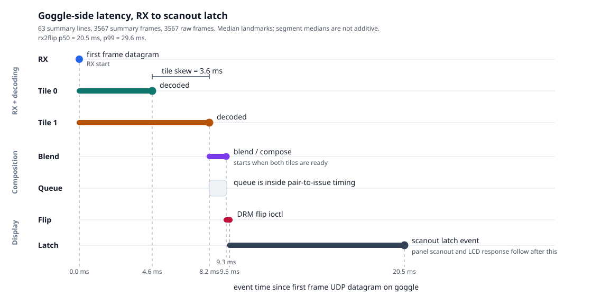

# Latency breakdown

This document summarizes the current measured latency pieces for the MissingLynk video path. It
separates the RF/network transport benchmark from the goggle-local receive/decode/display timing.

## Reproducing the goggle graph

Capture a new goggle-side latency run with:

```sh
SECS=60 glue/capture/goggle-latency-capture.sh
```

That creates a timestamped directory under `out/goggle-latency/` containing `ml-pipeline.log`,
`metadata.txt`, and a generated `goggle-latency-timeline.svg`.

Render an existing captured log with:

```sh
python3 glue/capture/goggle-latency-plot.py \
  path/to/ml-pipeline.log \
  -o path/to/goggle-latency-timeline.svg
```

## Goggle-local latency



The goggle-local total is `rx2flip`: first UDP video datagram for a frame in `rf_rx` through the DRM
flip event, which is the scanout latch.

| Metric | Value |
|---|---:|
| Frames parsed | 3567 |
| `rx2flip` p50 | 20.5 ms |
| `rx2flip` p99 | 29.6 ms |
| tile 0 `rx2dec` p50 | 4.6 ms |
| tile 1 `rx2dec` p50 | 8.2 ms |
| tile skew / pair p50 | 3.6 ms |
| pair complete -> flip ioctl entered p50 | 1.1 ms |
| flip ioctl entered -> returned p50 | 0.2 ms |
| flip returned -> latch event p50 | 8.9 ms |
| pair complete -> latch event p50 | 10.2 ms |

The `scanout latch` wait is display-refresh quantization, not active compute. At 60 Hz one refresh
period is 16.7 ms, so a submitted frame waits anywhere from near 0 ms to one period for the next
safe latch point. A faster panel would reduce this bucket, assuming the DSI timing and panel accept
the higher refresh.

The measurement stops at latch. Panel scanout to a specific row and LCD response happen after this
point and are not included in `rx2flip`.

## RF network benchmark

The production-critical direction is air unit -> goggle. The benchmark used UDP `iperf3` traffic
over the AR8030 IP tunnel while video transmission was stopped on the air unit. The RF netdev MTU
was 4096 bytes on both ends; the sweep varied UDP payload size, so payloads above 4096 bytes were
fragmented below the application.

Baseband identity for the BetaFPV VR04 HD run:

| End | Baseband image | SHA-256 |
|---|---|---|
| goggle | `/lib/firmware/bb_demo_gnd_d.img` | `8993aea4617351afb214518e060c2444897dded8710009fc9097ea409c1a8b00` |
| air | `/lib/firmware/bb_demo_air_d.img` | `fa80c8d72af34c8b25830b34124b0b08e0073b2d6d1dc7eb530cec42eaf4f12f` |

MCS/SNR note: this historical RF matrix did not capture explicit per-trial MCS/SNR samples. Treat
the numbers as the measured BetaFPV downlink ceiling for that bench setup, not as a standalone
channel-quality comparison. Current `glue/capture/rf-net-bench.sh` writes `raw/link-*.txt`
snapshots with goggle-side `Get1V1Info` SNR/PHY capacity and, when air SSH is available, air-side
`GET_MCS` MCS/throughput log samples around each iperf trial.

Fresh-battery validation, shown as `received Mbit/s / UDP loss / concurrent ping avg/max ms`:

| Payload | 16M offered | 20M offered | 24M offered |
|---:|---|---|---|
| 1024 | 16.00 / 0.00% / 66.1/106.1 | 20.00 / 0.35% / 50.7/54.0 | 20.52 / 0.00% / 84.4/101.3 |
| 2048 | 16.00 / 0.00% / 50.9/54.3 | 20.00 / 0.00% / 78.0/165.9 | 20.84 / 0.73% / 82.7/103.5 |
| 3584 | 16.00 / 0.00% / 51.4/54.2 | 20.00 / 0.00% / 55.0/78.5 | 20.91 / 0.29% / 96.6/126.8 |
| 4096 | 16.00 / 0.00% / 51.1/53.6 | 20.00 / 0.00% / 73.6/167.9 | 20.73 / 0.10% / 82.3/103.4 |
| 8192 | 16.00 / 0.00% / 50.5/53.1 | 20.00 / 0.00% / 51.5/54.4 | 20.82 / 0.04% / 82.8/104.0 |
| 11000 | 16.00 / 0.00% / 50.4/53.1 | 20.01 / 0.00% / 53.2/63.6 | 20.89 / 0.16% / 87.3/111.3 |
| 16000 | 16.01 / 0.00% / 51.4/56.0 | 20.00 / 0.00% / 53.5/57.5 | 20.86 / 0.00% / 87.0/110.1 |
| 19000 | 16.01 / 0.00% / 52.1/56.1 | 20.00 / 0.66% / 95.7/157.7 | 20.82 / 0.00% / 81.1/98.2 |

Interpretation:

- The measured downlink ceiling is about 20.0-20.6 Mbit/s on these BetaFPV baseband blobs.
- Offering 24M saturates the link: delivered throughput remains near the same ceiling while ping
  latency rises.
- 8192-byte UDP payloads were the best validated general-purpose point across 16M and 20M on both
  batteries.
- 11000 and 16000 bytes are still plausible production-size candidates, but need a full repeated
  matrix before replacing 8192 as the conservative default.

Full RF protocol, metadata requirements, plots, and raw-run references are in
`datasheets/rf-throughput-benchmark.md`.
